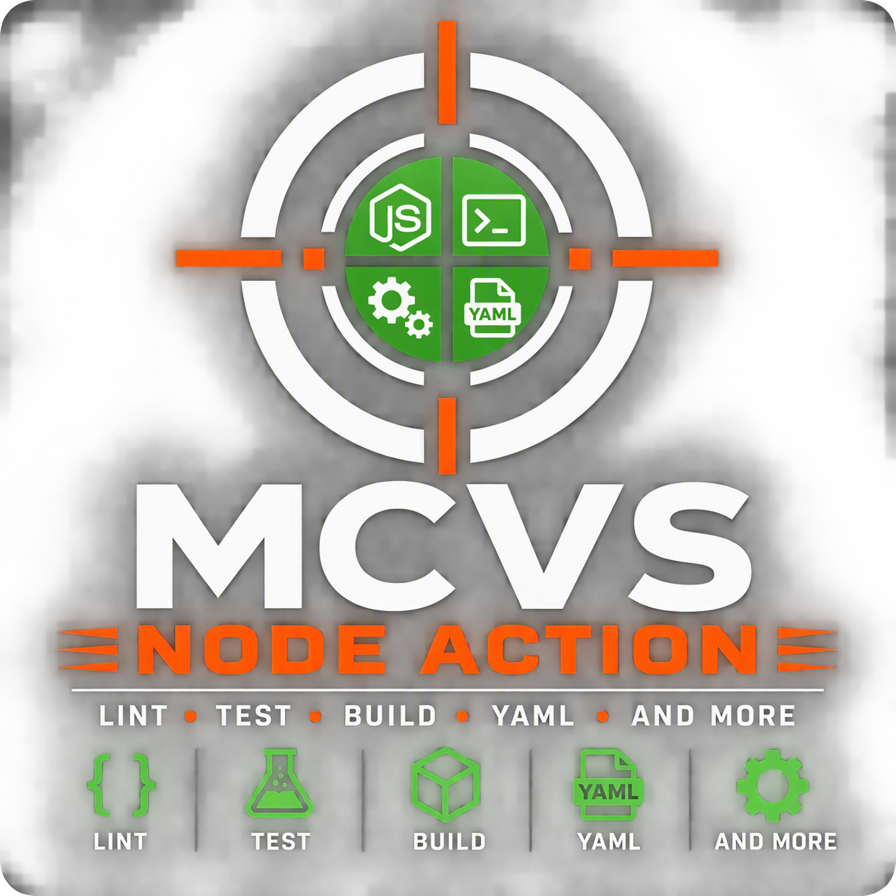

# MCVS-node-action

[](https://github.com/schubergphilis/mcvs-node-action/releases)
[](LICENSE)



Mission Critical Vulnerability Scanner (MCVS) Node Action. Create Node code
without high and critical vulnerabilities.

## Usage

Create a `.github/workflows/node.yml` file with the following content:

```yaml
---
name: Node
"on": push
permissions:
  contents: read # write if npm-pack-release is 'true'
jobs:
  MCVS-node-action:
    runs-on: ubuntu-24.04
    steps:
      - uses: actions/checkout@some-hash # v6.0.2
      - uses: schubergphilis/mcvs-node-action@some-hash # v0.1.0
```

<!-- markdownlint-disable MD013 -->

| Option            | Default               | Required | Description                                                         |
| :---------------- | :-------------------- | -------- | :------------------------------------------------------------------ |
| node-version-file | `.nvmrc`              |          | File that defines the Node version                                  |
| npm-pack-release  | `false`               |          | If `true`, attach an `npm pack` tarball to the release on tag push  |
| token             | `${{ github.token }}` |          | Token used to upload the release asset                              |

<!-- markdownlint-enable MD013 -->

The action runs:

1. Anchore (Grype) filesystem scan, failing on high/critical findings.
2. `npm ci --ignore-scripts` and `npm audit --audit-level=high` if a
   `package-lock.json` exists.
3. `npm run lint` and `npm test` if those scripts are defined.
4. On a tag push with `npm-pack-release: "true"`, `npm pack` and upload the
   tarball to the release.
